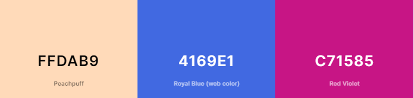
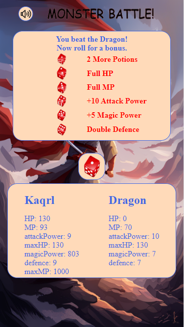
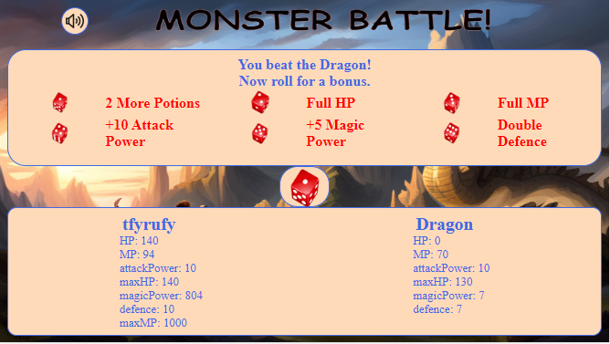
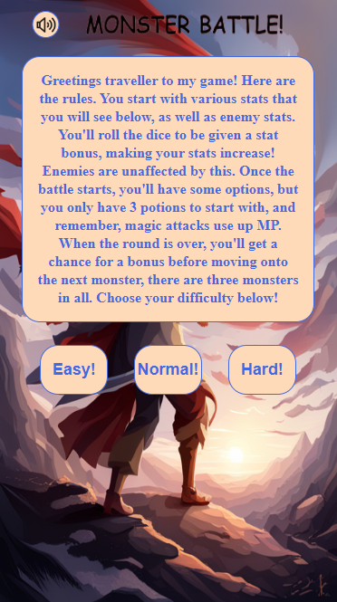
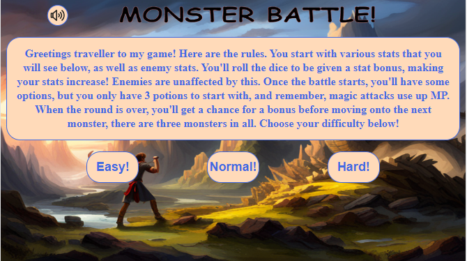
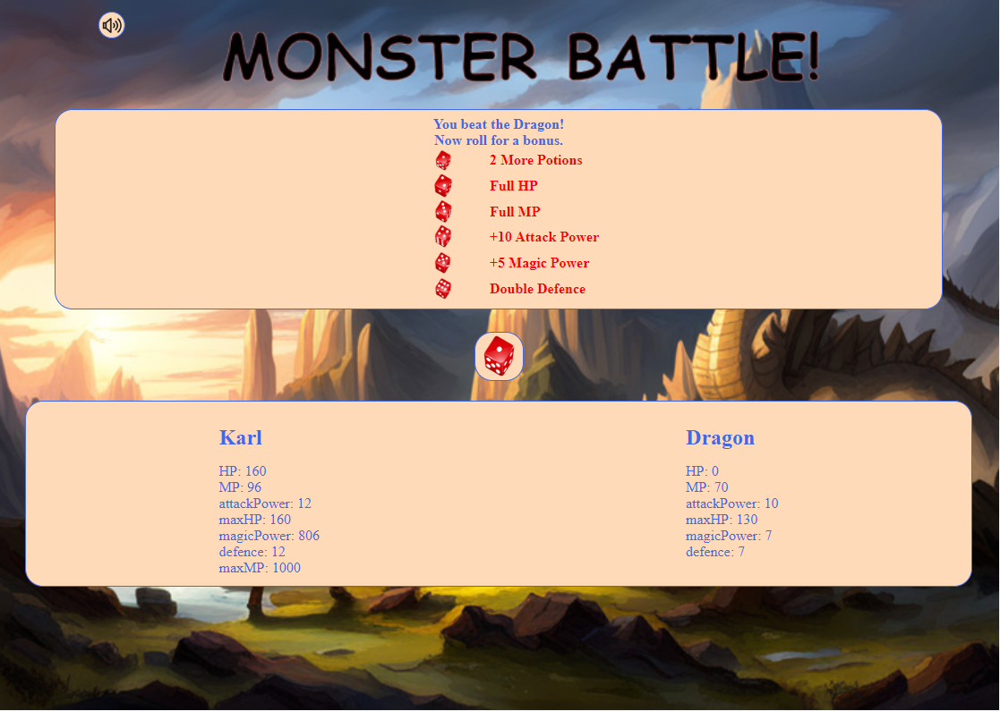

Monster Battle is a small minigame based on RPG game battle mechanics. The user will fight some different monsters and hopefully win a chain of battles.

## UX
### Visitor Goals
The target audience are:
* Gamers
* RPG Enthusiasts
* People looking to allievate boredom
* People looking for an insight to battle mechanics

Users are able to:
* Battle monsters
* Plan a strategy
* Earn bonuses
* Make different types of attack

### User Suggestions
1. I would like some animation
2. I would like different monsters
3. I would like a visual to see what is happening
4. I would like to be able to change difficulty

## Features

### Main page

Features:
- There is only one page and all the action takes place here.
- There is a brief tutorial on how to play the game.
- There are action buttons to determine the method of attack.
- There are difficulty options.
- There are bonus rounds between monsters.
- Background music can be toggled on and off.

## Design

### Fonts
Standard fonts are used throughout the site, plans to investigate better fonts.

### Icons
- Images are used for the action buttons and music.
- Plans to integrate images into the game area.

### Colour Scheme

After several trial and error attempts I decided on Aliceblue text and boundaries, set against a Peachpuff background. Buttons will change to purple when hovered to indicate play area.

### Styling
* Buttons are contained within a flexbox to allow scalability.
* All boxes and buttons are rounded and follow the same design.
* Background images change depending on the screen size and orientation.
* Smaller screens have scroll locked to prevent scrolling below the content area.
* Play, content and action button areas will scale depending on screen size and will adapt to bigger screens.
* Above content will also vanish and reappear depending on context.
* Redundant areas and elements will be deleted if not needed anymore.
* Input will check for player name, and use it in the stats area.
* Screens with larger displays will have larger borders to keep the game and action areas relatively high.

### Screen Size Handling
* Media queries used to handle screen size and orientation. JavaScript will catch horizontal displays and add content accordingly:  
   

   

   

* And on larger screens:

## Technologies Used
* HTML
* CSS
* JavaScript

## Testing
### Validation
* HTML tested with W3C HTML5 Validator every day.
* CSS has been validated with W3C CSS Validator every day or major change.

### Testing
* My site was sent to friends and family for feedback and testing.
* The username request form validated to check for input from the user and will not submit with improper information.
* As the site was built using a Windows 11 PC, majority of the testing was done on this machine in Chrome using devtools.
* Tested personally on a Windows 10 laptop with a smaller screen and my personal Android device.
* Tested personally in Chrome and Bing.
* Tested on iPhone X, Android 10 tablet, ChromeBook for orientation testing.
* Multiple Android and IOS devices used to test by family and friends who reported no errors in the site.

### Bugs Found
* Smaller screens would initially push the content underneath causing a scroll and looping background. This was repaired with media queries.
* Moving from if statements to switch cases caused the game to fail and throw errors. This was repaired by using the monsterName variable instead of the monster variable.
* Loops calling for monster stats initially repeated "NaN". This was repaired as initially I was calling the wrong variable.
* Moving the buttons appearing and disappearing to it's own function initially caused a bug where the buttons would fail to appear. This was due to an oversight; I had forgotten to include buttonsToggle() in some of the monster attack patterns.
* Mashing the potion button repeatedly on full health will occasionally cause the monster to attack out of turn. Unresolved, perhaps the dragon doesn't have patience.
* JavaScript is used to detect orientation of the screen, but if rotated after this check it can cause the layout to break.
* Monsters can use magic regardless of MP remaining, did not include a check for this.

### Deployment
1. Navigate to [https://github.com/Karl-Ryan0/monster-battle](https://github.com/Karl-Ryan0/monster-battle).
2. You can set up your own repository and copy or clone it, or you fork the repository.
3. `git add`, `git commit` and `git push` to a GitHub repository, if necessary.
4. GitHub pages will update from the master branch by default.
5. Go to the **Settings** page of the repository.
6. Scroll down to the **Github Pages** section.
7. Select the Master Branch as the source and **Confirm** the selection.
8. Wait a minute or two and it should be live for viewing.

Live link can be found [here](https://karl-ryan0.github.io/monster-battle/).

### Credits
* Background images generated by using the Photosonic section of [Writesonic](https://app.writesonic.com/).
* Music was downloaded from [Pixabay](https://pixabay.com/).
* Images for the buttons were downloaded from [Freepik](https://www.freepik.com/).